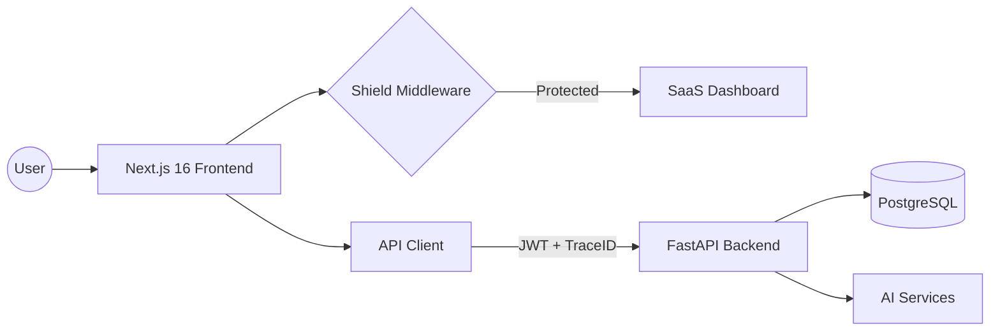

<div align="center">
  
  
  # Inopsio AI Enterprise Grade Architecture
  ### The 2026 Master Tier SaaS Boilerplate
  
  [](https://opensource.org/licenses/MIT)
  [](https://vercel.com)
  [](https://nextjs.org)
  [](https://fastapi.tiangolo.com)
  
  **"Liquid Glass" Aesthetic • Multi-Tenant Core • AI-First Infrastructure**
</div>

---

## 💎 The Vision

Stop building infrastructure from scratch. **Inopsio AI Enterprise** is a battle-tested, high-performance foundation tailored for 2026 standards. It fuses the visual drama of a cinematic frontend with the ruthless efficiency of a multi-tenant FastAPI backend.

> [!IMPORTANT]
> This is NOT just a template. This is a production-ready "Nervous System" for your next 100k+ DAU application.

---

## 🌌 The Master Tier Stack

### 🚀 Frontend (The Storefront)

- **Next.js 16.1 + React 19:** Utilizing Turbopack and React Server Components.
- **Tailwind CSS 4.x:** Next-gen styling with zero-runtime overhead.
- **Motion (Framer):** Liquid-smooth animations and glassmorphic transitions.
- **TanStack Suite:** Advanced request state and data-grid management.
- **i18n Ready:** Multi-language support baked into the routing.

### 🏭 Backend (The Warehouse)

- **FastAPI 0.115+:** Blazing fast Python API with automatic OpenAPI documentation.
- **Prisma + PostgreSQL:** Type-safe database management with a multi-tenant DNA.
- **JWT Auth + Bcrypt:** Secure-by-default identity and organization scoping.
- **Distributed Tracing:** Observability via `X-Request-ID` and process-time headers.

---

## 🏗️ Architecture Blueprint



---

## 🛠️ Getting Started in 30 Seconds

1. **Clone the Identity:**

   ```bash
   git clone https://github.com/inopsio/Inopsio-AI-Enterprise-Grade-Architecture.git
   ```

2. **Hydrate the Engine:**
   Follow our **[🚀 Start Here Guide](docs/start-here.md)** to wire up your environment and launch the platform.

---

## 🧩 Features at a Glance

| Feature             | Description                                                         |
| :------------------ | :------------------------------------------------------------------ |
| **Multi-Tenancy**   | Automatic organization scoping at the database level.               |
| **Enterprise Auth** | OAuth2 compatibility with login, signup, and reset flows.           |
| **Edge Guard**      | Next.js Middleware handling route protection at the speed of light. |
| **Type Safety**     | End-to-end sync between Pydantic models and TypeScript.             |
| **AI Injection**    | Foundation ready for Gemini/OpenAI integration.                     |

---

## 📂 Project Anatomy

- `frontend/`: The visual powerhouse. Screens, components, and design tokens.
- `backend/`: The logic engine. CRUD, schemas, and API routers.
- `docs/`: The master manual. Architecture decisions and standards.

---

<div align="center">
  <p>Built with passion by <strong>Inopsio HQ</strong></p>
  <p>Designed to be cloned. Built to scale.</p>
</div>
